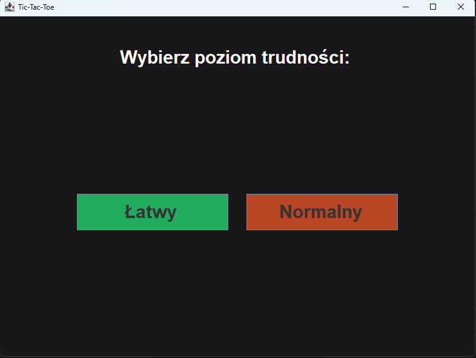
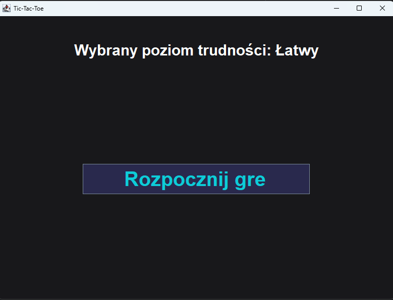

# Tic-Tac-Toe (Java Swing)

Gra Kółko i Krzyżyk napisana w języku Java z wykorzystaniem biblioteki Swing. 

Projekt jest w trakcie rozwoju – interfejs użytkownika (UI) znajduje się obecnie w wersji beta, ale pełna logika gry jest już w 100% zaimplementowana i grywalna.

## Wygląd aplikacji (Wersja Beta)

| Wybór poziomu | Ekran startowy | Rozgrywka |
| :---: | :---: | :---: |
|  |  |  |

## Funkcje

* **Graficzny interfejs użytkownika (GUI)** (wersja beta) z dopasowaną kolorystyką dla gracza i komputera.
* **Gra przeciwko komputerowi** (singleplayer).
* **Dwa poziomy trudności:**
  * **Easy** – komputer wykonuje całkowicie losowe ruchy.
  * **Normal** – komputer analizuje planszę, blokuje Twoje ruchy i szuka szansy na własną wygraną.
* **System punktów** na bieżąco zliczający wynik starcia (X vs O).
* **Reset gry** pozwalający wyczyścić planszę bez wyłączania aplikacji.

## Technologie

* **Java**
* **Swing** (obsługa GUI)

## Jak uruchomić

1. Sklonuj repozytorium:
   ```bash
   git clone [https://github.com/Ziollo/tic-tac-toe-java.git](https://github.com/Ziollo/tic-tac-toe-java.git)
   cd tic-tac-toe-java/src
   javac *.java
   ```
   ## Struktura projektu
   src/Main.java – punkt startowy aplikacji.

src/GUI.java – interfejs użytkownika.

src/logic.java – główna logika gry.

src/LevelEasy.java – łatwy algorytm AI.

src/LevelNormal.java – normalny algorytm AI.

src/Style.java – stylowanie i konfiguracja wyglądu GUI.
