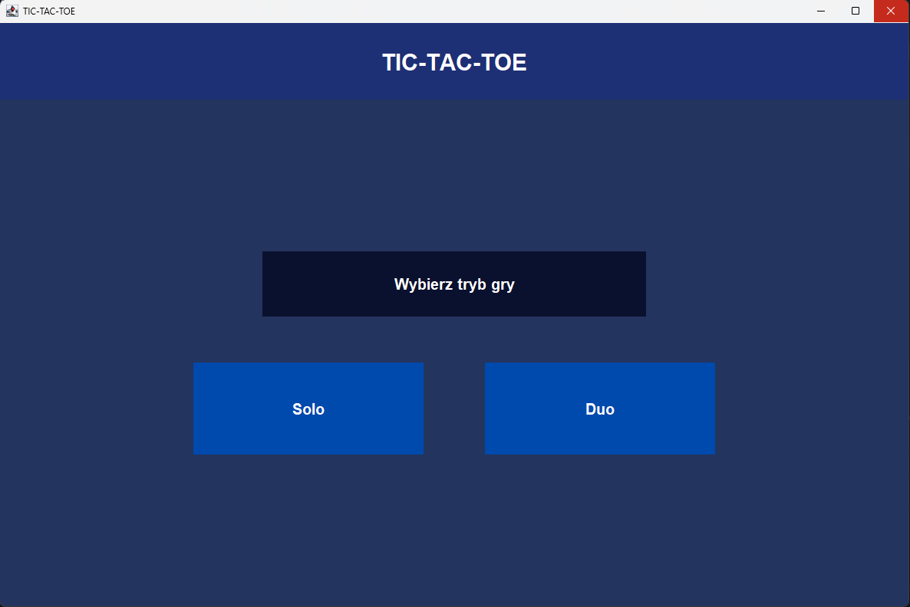
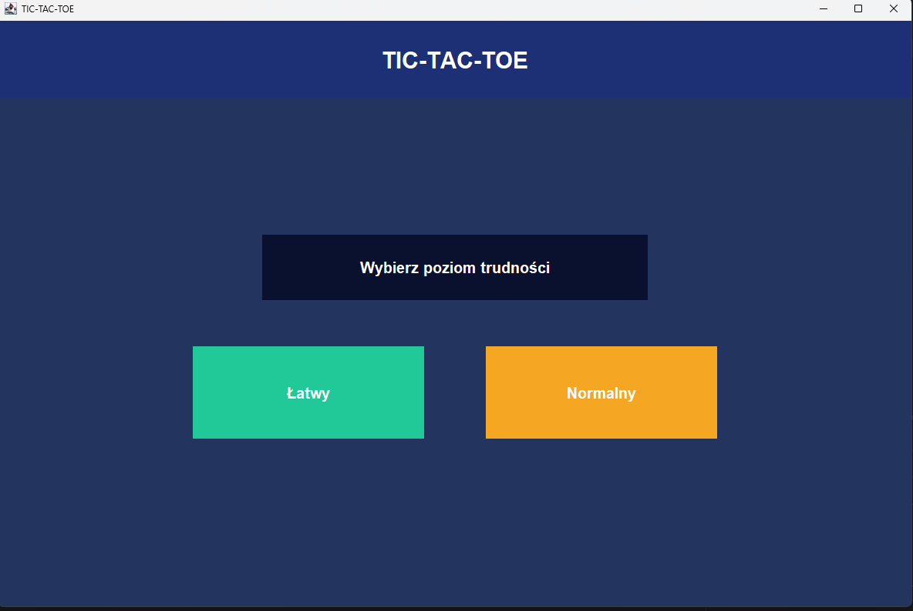
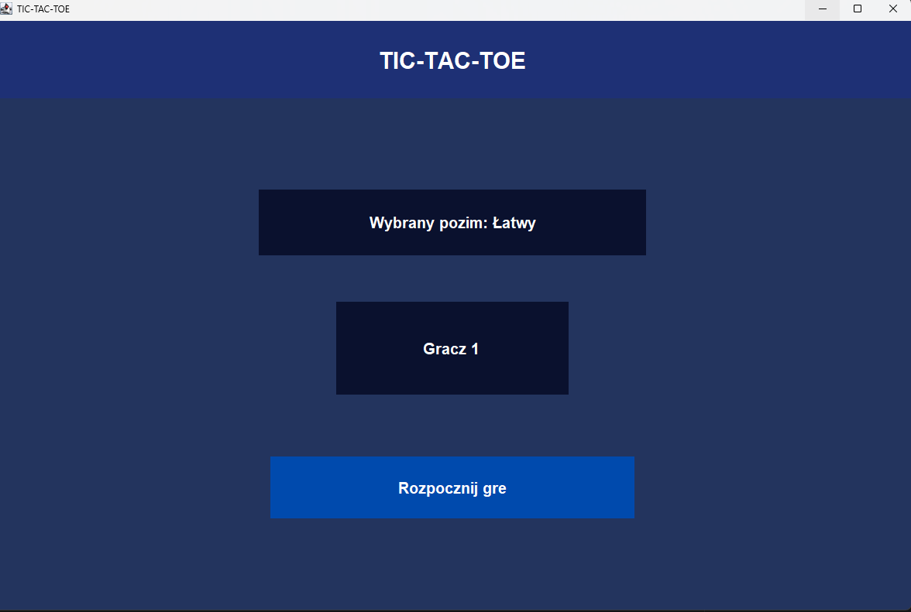
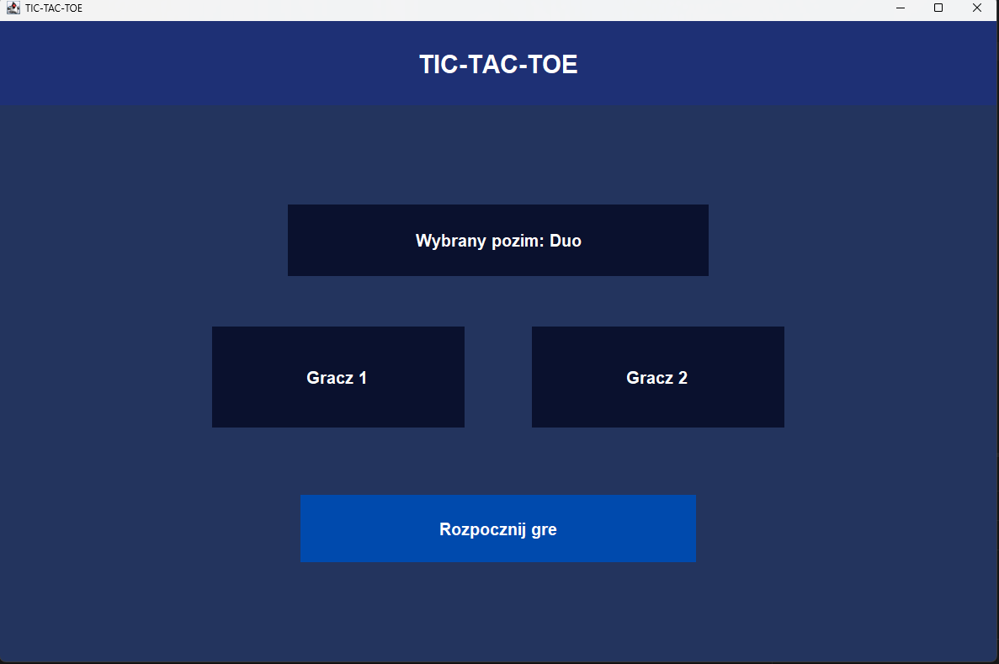
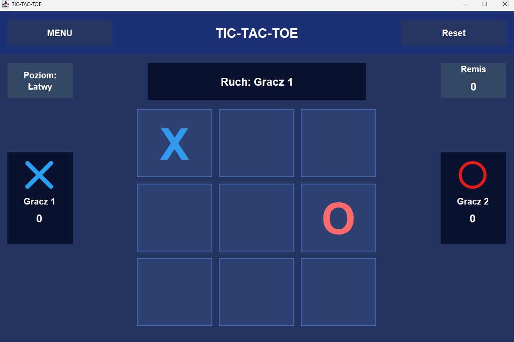

# Tic-Tac-Toe (Java Swing)

W pełni funkcjonalna gra Kółko i Krzyżyk napisana w języku Java z wykorzystaniem biblioteki Swing. 

Projekt posiada nowoczesny, niestandardowy interfejs graficzny (Dark Mode), obsługuje dwa tryby rozgrywki (Solo i Duo) oraz jest zoptymalizowany do działania na różnych systemach operacyjnych (w tym macOS).

## Funkcje

* **Dwa tryby gry:**
  * **Solo:** Gra przeciwko komputerowi.
  * **Duo:** Lokalny tryb wieloosobowy (PvP) dla dwóch graczy na jednym ekranie.
* **Personalizacja:** Możliwość wpisania własnych imion graczy przed rozpoczęciem partii.
* **Dwa poziomy trudności (Tryb Solo):**
  * **Łatwy (Easy):** Komputer wykonuje losowe ruchy.
  * **Normalny (Normal):** Komputer analizuje planszę, potrafi blokować ruchy gracza i szuka szans na wygraną.
* **Zaawansowana tablica wyników:** System na bieżąco zlicza wygrane obu graczy oraz remisy w trakcie trwania sesji.
* **Nowoczesny interfejs (UI):** Autorski "Dark Mode" ze spersonalizowanymi kolorami, efektami najechania (hover) i wsparciem wyświetlania na systemie macOS.

## Wygląd aplikacji 

**Krok 1: Wybierz tryb i poziom**
| Wybór trybu (Solo/Duo) | Wybór poziomu trudności |
| :---: | :---: | 
|  |  | 

**Krok 2: Wpisz imiona i graj**
| Ekran startowy 1 | Ekran startowy 2 | Rozgrywka |
| :---: | :---: | :---: | 
|  |  |  |

## Technologie

* **Java** (Logika obiektowa)
* **Java Swing & AWT** (Interfejs graficzny)

## Struktura projektu

Projekt został podzielony na obiekty, aby oddzielić warstwę wizualną (GUI) od logiki gry:

* `Main.java` - Punkt startowy aplikacji.
* `GUI.java` - Główna klasa odpowiedzialna za generowanie okien, układów (Layouts) i przechodzenie między ekranami.
* `Style.java` - Zewnętrzna klasa przechowująca całą konfigurację wizualną (kolory, fonty, wymiary, poprawki systemowe).
* `Logic.java` - Klasa abstrakcyjna zawierająca główne zasady gry i sprawdzanie warunków wygranej/remisu.
* `LogicSolo.java` - Implementacja logiki dla trybu jednoosobowego (komunikacja z algorytmami AI).
* `MoveToPlayer.java` - Implementacja logiki dla trybu dwuosobowego (zmiana tur między graczami).
* `LevelEasy.java` / `LevelNormal.java` - Algorytmy sterujące ruchami komputera.
